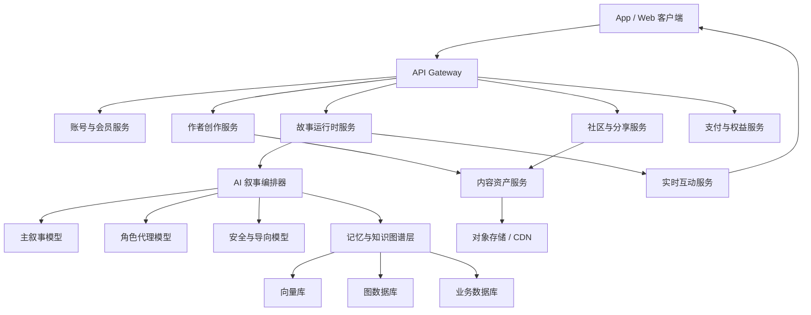
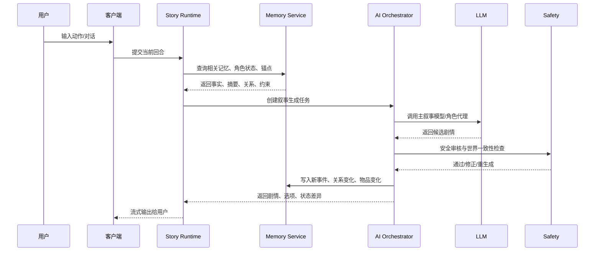

# 「入戏」InStory 产品规划与核心技术架构

版本：v1.0  
日期：2026-05-20  
定位：AI 驱动互动小说平台

## 1. 产品愿景

「入戏」（英文名 InStory）是一款让读者“亲身成为角色”的 AI 互动小说平台。

核心理念是：读者不再是旁观者，而是故事的“共同主演”。用户可以穿越进任意小说世界，扮演主角、反派、配角，或植入自定义角色，通过选择、对话和行动真正改变故事走向。

一句话介绍：

> 一个让读者“亲身成为角色”的 AI 驱动互动叙事平台。你不再“读”小说，而是“演”小说。

产品口号：

> 翻开下一章，主角就是你。

核心价值：

- 打破第四面墙：每位读者都能以第一人称/第二人称视角进入故事，获得独一无二的剧情体验。
- AI 动态叙事：不再依赖固定分支树，AI 根据当前状态实时生成合理后续。
- 创作与阅读共生：作者搭建世界骨架、规则和剧情锚点，AI 填充细节，读者参与塑造分支。

## 2. 核心用户体验

### 2.1 进入故事

用户进入一本互动小说时，可选择三种方式：

1. 化身现有角色
   - 可扮演主角、反派或配角。
   - 系统展示角色性格、背景、目标、关系、当前处境摘要。

2. 植入自定义角色
   - 用户创建自己的分身。
   - 设定身份、特长、缺陷、与世界的初始关系。
   - AI 将角色合理融入开局，避免突兀穿插。

3. 盲入模式
   - 系统随机分配身份和初始处境。
   - 适合悬疑、逃生、宫斗、无限流等高惊喜题材。

### 2.2 沉浸式交互

故事默认以第二人称“你”展开，配合环境描写、NPC 对话和角色心理反馈。

交互方式：

- 自然语言操控：用户直接输入想说的话或想做的动作。
- 智能选项辅助：系统生成 2 到 4 个符合角色、场景和剧情压力的选项。
- 状态面板：展示情绪、体力、关系值、线索、物品、阵营、风险等。
- 叙事推进：每回合生成 200 到 500 字剧情，并将用户推向下一轮选择。

### 2.3 记忆与回溯

- 记忆书签：关键转折点自动生成剧情节点。
- 回溯重演：用户可回到任意节点探索另一种可能。
- 蝴蝶效应：章节末展示用户已改变的关键事件，与预设主线对比。
- 旅程归档：每次通关形成独立故事线，可收藏、分享、复盘。

## 3. 平台功能架构

### 3.1 读者端

读者端包括 App 与 Web，核心是互动阅读体验。

主要功能：

- 故事广场：按类型、热度、互动人数、完成率、AI 自由度筛选作品。
- 互动阅读器：承载文本、选项、自由输入、角色状态、回溯节点。
- 多模态沉浸：根据场景匹配氛围图、环境音、轻音乐、NPC 语音。
- 成就与收藏：收藏神对话、关键片段、隐藏剧情、特殊结局。
- 多结局画廊：每次通关生成专属结局卡，附选择统计和关键影响。
- 分享系统：分享结局卡、分支片段、角色身份卡。

### 3.2 作者端

作者端是创作工坊，目标是让作者从穷举分支中解放出来。

主要功能：

- 世界创建器：设定世界观、时间线、地点、阵营、规则。
- 角色档案：设定性格、目标、口癖、禁忌行为、关系网。
- 剧情锚点：定义必须发生或强建议发生的核心事件。
- 角色约束集：限制 AI 输出，防止人设崩塌。
- AI 辅助润色：生成片段、补全设定、检查矛盾、模拟试玩。
- 分支样本测试：一键生成多个玩家路径样本，供作者调优。

### 3.3 社区与 UGC

社区端让读者创造的分支反哺原作品。

主要功能：

- 副本分流广场：高赞分支申请成为“平行世界副本”。
- 角色扮演大厅：多人进入同一故事世界，AI 担任主持人。
- 共创工作室：多位作者共同搭建同一宇宙。
- 二创治理：原作者授权、收益分成、内容审核、版本管理。

## 4. 核心技术架构

### 4.1 总体架构

InStory 适合采用“端侧互动 + 后端编排 + AI 叙事引擎 + 内容资产系统”的分层架构。



核心原则：

- 客户端只负责互动体验，不直接调用模型。
- 后端统一管理剧情状态、计费、风控、记忆、模型调用。
- AI 输出必须经过状态校验、安全过滤和剧情约束检查。
- 每次生成都要可追踪、可回放、可审计。

### 4.2 客户端架构

客户端可优先做 Web + App 复用架构。

推荐形态：

- Web：React / Next.js，适合快速验证作者端、社区端、Web 阅读。
- App：Flutter 或 React Native，适合跨平台上线；若沿用现有 Android 资产，可先做 Android 原生 MVP。
- 阅读器内核：独立状态机模块，管理当前场景、选项、输入、回溯、渲染。
- 本地缓存：缓存故事资产、最近会话、图片、音频、断线恢复状态。

客户端核心模块：

- Story Reader：互动阅读器
- Character Panel：角色状态面板
- Timeline / Bookmark：记忆书签与回溯
- Media Layer：背景图、音效、语音播放
- Creator Studio：作者工具
- Community Feed：副本、结局卡、片段分享

### 4.3 后端服务架构

建议采用模块化单体起步，核心稳定后再拆为微服务。MVP 阶段避免过早拆分，优先保证叙事链路可控。

核心服务：

| 服务 | 职责 |
| --- | --- |
| API Gateway | 鉴权、限流、路由、灰度、请求日志 |
| Auth Service | 登录、用户资料、设备、风控 |
| Story Runtime Service | 运行故事会话、保存状态、处理回合推进 |
| AI Orchestrator | 组装提示词、调用模型、校验输出、更新记忆 |
| Memory Service | 摘要、向量检索、知识图谱、因果链 |
| Creator Service | 世界、角色、锚点、约束、测试运行 |
| Content Asset Service | 图片、音频、封面、结局卡、素材 CDN |
| Community Service | 评论、点赞、收藏、分支副本、分享 |
| Payment Service | 会员、金币、故事通行证、创作者分成 |
| Moderation Service | 文本、图片、语音审核与安全策略 |
| Analytics Service | 留存、互动回合、生成成本、转化率 |

推荐技术选型：

- API：REST 起步，互动流式输出使用 SSE；多人实时可用 WebSocket。
- 后端语言：Java/Kotlin、Go 或 Node.js 均可。若复用当前 Android/Java 生态，后端可选 Kotlin + Spring Boot。
- 数据库：PostgreSQL 存业务数据，Redis 存热状态与限流，Neo4j/JanusGraph 存知识图谱，Milvus/pgvector 存向量。
- 消息队列：Kafka / Pulsar / RabbitMQ，用于生成任务、媒体任务、审核任务、埋点。
- 对象存储：S3 兼容存储 + CDN。

### 4.4 AI 叙事引擎

AI 叙事引擎是平台核心，不是单一 LLM 调用，而是一套受控生成系统。

#### 4.4.1 回合生成流程



#### 4.4.2 主叙事模型

职责：

- 根据当前场景、用户行为、角色状态、历史摘要、剧情锚点生成下一段叙事。
- 控制文字长度、节奏、悬念、情绪、结尾钩子。
- 输出结构化结果，包含正文、选项、状态变化、潜在事件、风险标签。

建议输出 JSON Schema：

```json
{
  "narration": "你屏住呼吸，听见门外的脚步声停在了三步之外……",
  "dialogues": [
    {
      "speaker": "陆清河",
      "text": "别出声。有人在找你。"
    }
  ],
  "choices": [
    {"id": "c1", "text": "追问陆清河真相", "risk": "medium"},
    {"id": "c2", "text": "躲进屏风后等待", "risk": "low"}
  ],
  "state_delta": {
    "emotion": {"fear": 8},
    "relations": [{"character_id": "lu_qinghe", "trust": 3}],
    "items_added": [],
    "clues_added": ["门外的人知道你的藏身处"]
  },
  "anchor_progress": {
    "current_anchor_id": "corpse_found",
    "distance": 0.62
  },
  "memory_events": [
    "玩家选择相信陆清河，并暂时躲避门外追查者。"
  ]
}
```

#### 4.4.3 世界一致性与记忆层

记忆层分三类：

1. 短期上下文
   - 最近 5 到 20 轮对话与叙事。
   - 保证当下连续性。

2. 长期摘要
   - 按章节、场景、角色关系生成摘要。
   - 控制上下文成本。

3. 结构化世界状态
   - 人物是否存活、位置、关系、阵营、物品归属、时间线、已触发事件。
   - 用图数据库或关系数据库存储。

知识图谱核心实体：

- Story
- World
- Character
- ReaderRole
- Scene
- Location
- Item
- Clue
- Event
- Anchor
- Relationship
- TimelineNode

关键关系：

- `CHARACTER_AT_LOCATION`
- `CHARACTER_KNOWS_CLUE`
- `CHARACTER_HAS_ITEM`
- `CHARACTER_RELATION`
- `EVENT_CAUSES_EVENT`
- `EVENT_ADVANCES_ANCHOR`
- `PLAYER_CHANGED_EVENT`

一致性检查规则：

- 已死亡角色不能无解释出现。
- 物品不能被两个角色同时持有，除非可复制。
- 场景时间不能倒退，除非使用回溯或梦境机制。
- NPC 行为不得违反“绝不会做的事”。
- 玩家行为超出世界能力边界时，AI 应给出合理失败或代价，而不是直接满足。

#### 4.4.4 角色代理模型

角色代理负责 NPC 的动机、口吻和反应。

每个核心 NPC 需要维护：

- 角色档案：身份、目标、恐惧、秘密、口癖、价值观。
- 对玩家态度：信任、好感、怀疑、敌意、依赖。
- 当前情绪：愤怒、恐惧、紧张、爱慕、厌恶等。
- 知识边界：NPC 知道什么、不知道什么、误以为什么。
- 行为边界：绝不做的事、可能被诱导做的事、代价。

运行方式：

- MVP：不需要真的给每个 NPC 独立部署小模型，可用同一个大模型 + 角色卡 + 状态注入实现。
- 成长期：为高热角色建立专属 LoRA / Prompt Profile / 语音包。
- 成熟期：为多人实时场景引入 Actor Agent 调度，多个 NPC 可并行思考。

#### 4.4.5 剧情锚点系统

剧情锚点用于保证故事有主线张力，不滑向无意义闲聊。

锚点类型：

- 必达锚点：必须发生，如“死者被发现”。
- 可选锚点：可能触发，如“获得关键证词”。
- 禁止锚点：不可发生，如“反派提前自白”。
- 结局锚点：通向不同结局的关键条件。

每个锚点包含：

- 触发条件
- 前置事件
- 推荐场景
- 涉及角色
- 可接受变体
- 偏离处理策略

偏离处理：

- 轻度偏离：通过 NPC 提醒、线索出现、环境变化引导回主线。
- 中度偏离：增加代价或阻碍，如错过时机、关系下降。
- 重度偏离：生成平行分支，标记为非主线副本。

### 4.5 安全、审核与导向

安全系统要同时处理内容安全、未成年人保护、版权/IP 风险和叙事边界。

文本安全：

- 用户输入审核
- 模型输出审核
- 上下文风险累计
- 敏感题材分级

叙事导向：

- 防止无限循环。
- 防止无意义灌水。
- 防止玩家一句话摧毁世界观。
- 防止 NPC 人设崩塌。
- 防止模型绕过付费和权益限制。

审核策略：

- 低风险：直接生成。
- 中风险：改写为更安全的叙事表达。
- 高风险：拒绝并给出世界观内的自然阻断。
- 争议内容：进入人工审核或作品分级。

### 4.6 多模态生成架构

MVP 先做纯文本，第二阶段再引入多模态。

多模态任务：

- 场景氛围图：根据场景摘要生成或检索背景图。
- 结局卡：根据旅程摘要生成专属插画。
- NPC 语音：根据角色音色进行 TTS。
- 环境音/配乐：根据场景标签选择素材库。

推荐策略：

- 高频资产优先检索复用，降低成本。
- 关键结局卡异步生成，不阻塞主叙事。
- 用户可关闭多模态，降低延迟和费用。
- 作者可上传自有素材，AI 仅做补全。

### 4.7 多人互动架构

多人模式需要实时同步和 AI 主持人。

核心组件：

- Room Service：房间、角色席位、权限。
- Realtime Gateway：WebSocket 连接、广播、断线重连。
- Turn Manager：回合制/半实时节奏控制。
- AI Game Master：汇总多人输入，裁决冲突，推进剧情。
- Conflict Resolver：多人行为冲突处理。

多人模式建议从回合制起步：

- 每轮限定 30 到 90 秒输入。
- AI 统一结算所有玩家行为。
- 重要冲突由系统给出投票、检定或优先级。

### 4.8 数据模型设计

核心业务表建议：

| 表 | 说明 |
| --- | --- |
| `users` | 用户 |
| `stories` | 作品 |
| `story_versions` | 作品版本 |
| `worlds` | 世界设定 |
| `characters` | 角色档案 |
| `story_anchors` | 剧情锚点 |
| `character_constraints` | 角色约束 |
| `reader_sessions` | 用户故事会话 |
| `session_turns` | 每回合输入输出 |
| `timeline_nodes` | 记忆书签/回溯节点 |
| `state_snapshots` | 状态快照 |
| `memory_events` | 结构化记忆事件 |
| `endings` | 结局记录 |
| `achievements` | 成就 |
| `ugc_branches` | 平行副本 |
| `payments` | 支付订单 |
| `entitlements` | 会员/权益 |
| `creator_revenue` | 创作者分成 |

### 4.9 成本与性能控制

AI 互动小说的主要成本来自模型调用、长上下文、图片生成和语音。

控制策略：

- 摘要压缩：每 N 轮生成章节摘要，减少上下文长度。
- 分层模型：普通回合用低成本模型，关键剧情用高质量模型。
- 缓存选项：智能选项可异步预生成。
- 批量审核：低风险作品走轻量审核，高风险内容走强审核。
- 用户权益限制：免费用户限制每日回合数、上下文长度、多模态次数。
- 作者测试额度：创作者工具使用独立额度和成本看板。

核心性能指标：

- 首 token 延迟：目标 1 到 3 秒。
- 单回合完整生成：目标 5 到 12 秒。
- 回合失败率：低于 1%。
- 安全重生成率：可观测并按题材优化。
- 单回合平均成本：作为商业化定价基础。

## 5. 商业模式

### 5.1 会员订阅

基础免费，付费会员享受：

- 更多每日 AI 回合
- 更长记忆空间
- 高级语音包
- 多模态结局卡
- 高级回溯节点
- 无广告或少广告

### 5.2 单本买断 / 故事通行证

适合独家签约作品、知名 IP 改编作品。

模式：

- 单本买断
- 限时租赁
- 章节包
- 高级结局解锁

### 5.3 创作者激励

创作者收益来源：

- 互动量分成
- 会员转化分成
- 单本售卖分成
- 平行副本收益分成
- 官方签约保底

### 5.4 虚拟物品

可售卖：

- 角色皮肤
- 身份卡
- 特殊道具卡
- 高级背景图
- 专属语音
- 结局卡模板

需要注意：道具应增强趣味，不应破坏叙事公平和作者设定。

## 6. 开发路线图

### Phase 1：核心闭环 MVP

目标：验证“AI 互动小说”核心体验是否成立。

范围：

- 纯文本互动阅读器
- 自由输入 + 智能选项
- 基础 AI 叙事引擎
- 基础记忆摘要
- 状态面板
- 关键节点回溯
- 3 到 5 部示范作品
- 极简作者工具
- 基础会员/回合额度

建议周期：8 到 12 周。

### Phase 2：沉浸感与创作生态

目标：提高内容供给和留存。

范围：

- UGC 世界创建器
- 剧情锚点系统
- 角色约束集
- 氛围图、音效、TTS
- 结局卡
- 社区、收藏、分享
- 平行副本申请
- 创作者收益看板

建议周期：12 到 20 周。

### Phase 3：多人宇宙与智能进化

目标：建立平台壁垒。

范围：

- 多人角色扮演大厅
- AI 主持人
- 共创工作室
- 复杂世界知识图谱
- 高热角色专属语音/人格
- IP 联合改编
- 创作者学院

建议周期：6 到 12 个月。

## 7. MVP 技术落地建议

MVP 不要一开始追求完整知识图谱和多 Agent。推荐先实现可控、可验证的最小叙事闭环。

优先级：

1. 故事会话状态机
2. 作者配置：世界、角色、锚点、约束
3. 单回合叙事生成
4. 短期上下文 + 章节摘要
5. 状态差异 JSON 输出
6. 回溯节点与状态快照
7. 安全审核
8. 简单权益计费

MVP 可暂缓：

- 多人实时
- 独立 NPC 小模型
- 完整图数据库
- 图片/语音生成
- 平行副本收益分成
- 复杂创作者协作

## 8. 关键风险

- 叙事一致性风险：长故事容易遗忘、矛盾，需要状态化记忆和强校验。
- 成本风险：高频 AI 回合可能造成模型成本失控，需要权益、缓存和分层模型。
- 内容安全风险：用户自由输入会放大审核难度，需要输入输出双审。
- 作者体验风险：作者工具若太复杂，会影响 UGC 供给；需从模板化开始。
- 版权风险：知名小说改编必须获得授权，用户上传 IP 内容也需治理。
- 多人模式风险：实时互动复杂度高，应放到第三阶段。

## 9. 北极星指标

建议核心指标：

- 首次故事完成率
- 人均每日互动回合数
- 单故事平均回溯次数
- 用户收藏/分享率
- 7 日留存
- 会员转化率
- 单回合生成成本
- 作者作品发布数
- UGC 作品互动量
- 安全拦截与重生成率

最终目标不是让用户多看几章，而是让用户不断产生“这是我亲手改变的故事”的体验。

## 11. 开发启动

当前工程采用 Node.js / TypeScript monorepo，包含服务端、Web 客户端和共享包。

### 环境要求

- Node.js 24+
- npm 11+

### 安装依赖

```bash
npm install
```

### 配置环境变量

复制 `.env.example` 为 `.env`，默认使用 Mock AI，无需 API Key：

```bash
cp .env.example .env
```

如需接入真实模型，将 `LLM_PROVIDER` 改为 `openai-compatible`，并配置：

- `LLM_BASE_URL`
- `LLM_API_KEY`
- `LLM_MODEL`

服务端默认使用 SQLite 保存读者会话：

- 默认路径：`data/instory.sqlite`
- 可通过 `SQLITE_DATABASE_PATH` 覆盖

### 启动服务端

```bash
npm run dev:server
```

默认地址：

- API: `http://localhost:4000`
- 健康检查: `http://localhost:4000/api/health`

### 启动 Web 客户端

```bash
npm run dev:web
```

默认地址：

- Web: `http://localhost:3000`

### 常用检查

```bash
npm run typecheck
npm run build
```
