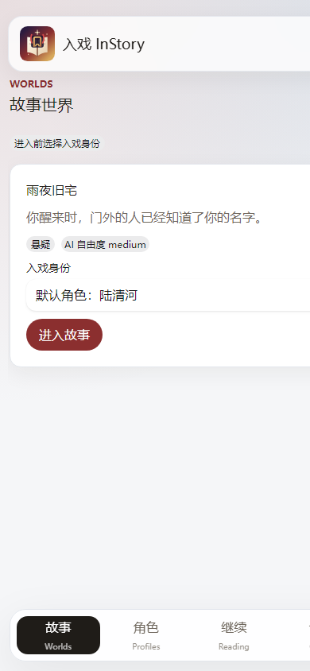
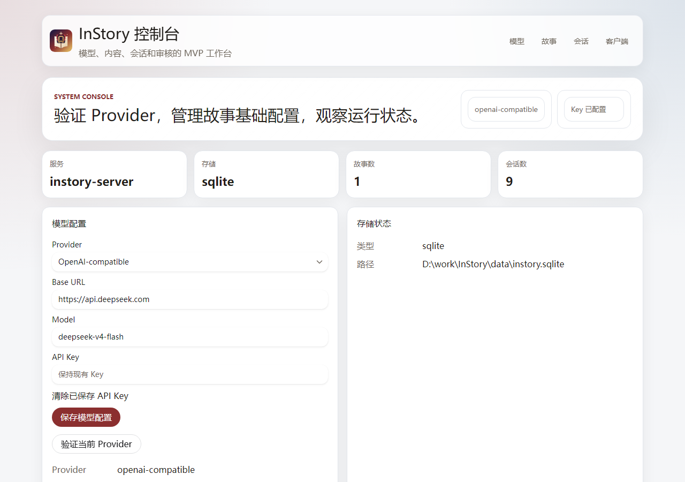

# InStory

<p align="center">
  
</p>

<p align="center">
  <strong>「入戏」InStory：AI 驱动互动小说平台</strong>
</p>

<p align="center">
  翻开下一章，主角就是你。
</p>

<p align="center">
  <a href="#开发启动">开发启动</a>
  ·
  <a href="docs/PRODUCT_PLAN.md">产品规划</a>
  ·
  <a href="docs/ARCHITECTURE.md">架构规划</a>
  ·
  <a href="docs/INTERACTION_DESIGN.md">交互设计</a>
  ·
  <a href="docs/PROGRESS.md">项目进度</a>
</p>

## 项目概览

InStory 是一个开源的 AI 互动叙事项目，目标是让读者不再只是旁观故事，而是以角色身份进入小说世界，通过选择、对话和行动改变剧情走向。

当前 MVP 聚焦纯文本互动叙事闭环：

- Web 互动阅读器：故事列表、创建会话、选项、自由输入、状态面板、记忆书签。
- 服务端运行时：Fastify API、SQLite 持久化、故事状态机、回溯分支。
- AI 编排：Mock Provider 与 OpenAI-compatible Provider。
- 管理后台：只读 Admin 控制台，用于查看模型配置、运行状态、故事配置、最近会话和审核占位。

## 当前状态

| 模块 | 状态 |
| --- | --- |
| Web 客户端 | 首页工作台（探索 / 书架 / 创作 / 我的角色）、阅读器、Admin 控制台 |
| 服务端 API | 账号、故事、会话、回合（含 SSE 流式）、回溯、创作编辑、阅读数据、Admin API |
| 存储 | SQLite（`node:sqlite`），本地默认 `data/instory.sqlite`，schema 由 `apps/server/src/db/migrations.ts` 的 9 条迁移决定 |
| AI | 默认 Mock，可切换 OpenAI-compatible，并在 Admin 控制台验证 |
| 测试 | `npm run test` 单元测试 + `npm run test:e2e` Playwright 端到端 |
| 进度与下一步 | 见 [docs/PROGRESS.md](docs/PROGRESS.md) |

## 界面预览

<p>
  
</p>

<p>
  
</p>

## 技术栈

- Monorepo：npm workspaces
- Web：Next.js / React / TypeScript / HeroUI / Tailwind CSS
- Server：Node.js / Fastify / TypeScript
- Storage：SQLite via Node.js `node:sqlite`
- Validation：Zod
- Test：Vitest + Playwright

## 代码结构

```text
apps/
  server/      # Fastify API、SQLite 存储、Admin API
  web/         # Next.js Web 客户端、阅读器、Admin 控制台
packages/
  shared/      # 共享领域类型与 Zod schema
  story-engine/# 叙事状态机、状态差异、时间线节点
  ai-orchestrator/ # Mock / OpenAI-compatible 模型 Provider
docs/
  PRODUCT_PLAN.md
  ARCHITECTURE.md
  INTERACTION_DESIGN.md
  ADR-UI-STACK.md
  PROGRESS.md
e2e/           # Playwright 端到端用例
```

## 文档

- [产品规划](docs/PRODUCT_PLAN.md)：产品愿景、用户体验、功能范围、商业模式、路线图和核心指标。
- [架构规划](docs/ARCHITECTURE.md)：服务端、客户端、AI 编排、数据模型和 MVP 工程实施路线。第 0 节列出本文档和实际实现的差距。
- [交互设计](docs/INTERACTION_DESIGN.md)：四类用户（访客、读者、创作者、管理员）的完整流程、页面结构和能力边界。
- [UI 技术选型](docs/ADR-UI-STACK.md)：HeroUI + Tailwind 的决策记录。
- [项目进度](docs/PROGRESS.md)：当前现状、已实现能力、代码地图、迁移清单、工程约定和下一步。**接手项目先读这份。**

## 开发启动

当前工程采用 Node.js / TypeScript monorepo，包含服务端、Web 客户端和共享包。

### 环境要求

- Node.js 24+
- npm 11+

### 安装依赖

```bash
npm install
```

### 配置环境变量

复制 `.env.example` 为 `.env`，默认使用 Mock AI，无需 API Key：

```bash
cp .env.example .env
```

这份根目录的 `.env` 由服务端读取（`apps/server` 的 dev/start 脚本带
`--env-file-if-exists=../../.env`）。已经导出到 shell 里的变量优先级更高，所以
`npm run test:e2e` 显式传的那套配置不会被它覆盖。Web 侧的变量（`ADMIN_TOKEN`、
`API_PROXY_TARGET`、`NEXT_PUBLIC_API_BASE`）要放在 `apps/web/.env`——Next.js 只读自己
目录下的 env 文件，不会向上找根目录。

如需接入真实模型，将 `LLM_PROVIDER` 改为 `openai-compatible`，并配置：

- `LLM_BASE_URL`
- `LLM_API_KEY`
- `LLM_MODEL`

服务端默认使用 SQLite 保存读者会话：

- 默认路径：`data/instory.sqlite`
- 可通过 `SQLITE_DATABASE_PATH` 覆盖

Admin API 使用 `ADMIN_TOKEN` 保护：

```http
Authorization: Bearer dev-admin-token
```

本地开发如果不设置 `ADMIN_TOKEN`，Admin API 默认允许访问；部署环境必须设置。

### 首次启动自带的示例数据

服务端第一次启动时会创建三个示例账号和两个示例故事，这样装完就能直接读、直接进后台，
不用先手动注册再想办法给自己发管理员角色：

- `admin@instory.local`（示例管理员，`role = admin`，能进 `/admin`）
- `author@instory.local`（示例作者，名下有「月下市集」和「虚空邮差」）
- `reader@instory.local`（示例读者，带一个入戏角色「江照」）

密码统一是 `instory-demo-2026`，用 `DEMO_PASSWORD` 覆盖。这套数据按账号邮箱判重：只要
`admin@instory.local` 已存在就整体跳过，重启不会重复创建，也不会覆盖你后来改过的故事。

`SEED_DEMO_DATA` 控制开关：非生产默认开，生产默认关。生产环境如果显式设成 `true`，必须
同时给 `DEMO_PASSWORD`——否则等于凭空多出三个密码写在文档里的账号，服务端会直接拒绝启动。
对外部署前请删掉或改掉这些账号。


模型 Provider 可在 Admin 控制台保存为 Mock 或 OpenAI-compatible。API Key 只存储在服务端 SQLite，不会在 Admin API 或页面中回显。
保存后可点击“验证当前 Provider”，系统会发起一次最小叙事生成并校验返回结构。
Base URL 可填写 Provider 根地址，例如 `https://api.deepseek.com` 或 `https://api.openai.com/v1`；如果误填完整 `/chat/completions` 地址，服务端会直接使用该地址，不会重复拼接。

### 启动服务端

```bash
npm run dev:server
```

默认地址：

- API: `http://localhost:4000`
- 健康检查: `http://localhost:4000/api/health`
- Admin 状态: `http://localhost:4000/api/admin/status`

### 启动 Web 客户端

```bash
npm run dev:web
```

默认地址：

- Web: `http://localhost:3000`
- Admin 控制台: `http://localhost:3000/admin`

`/admin` 按账号角色拦截：未登录跳 `/login`，普通读者跳回首页。把自己的邮箱写进 `ADMIN_EMAILS`（逗号分隔）即可获得管理员身份——注册时直接生效，已有账号在下次登录时自动提权；已有管理员也可以用 `PUT /api/admin/users/:userId/role` 把角色发给别人。拿到角色后，首页账号栏会出现 `管理控制台` 入口。

如果服务端设置了 `ADMIN_TOKEN`，Web 服务也需要设置同样的 `ADMIN_TOKEN`，用于服务端渲染 `/admin` 时请求 Admin API。

用户侧的完整流程（访客、读者、创作、管理员）见 `docs/INTERACTION_DESIGN.md` 第 11–13 章。

### 常用检查

```bash
npm run typecheck
npm run test
npm run build
```

端到端测试自带 dev server，跑在自己的端口（API 4100 / Web 3100）和自己的数据库
`data/e2e.sqlite` 上，所以本地的 `dev:server` / `dev:web` 可以一直开着：

```bash
npm run test:e2e
```


### 验证模型 Provider

默认使用 Mock Provider 验证叙事输出结构：

```bash
npm run verify:llm
```

验证真实 OpenAI-compatible 模型时，需要先配置：

```bash
LLM_PROVIDER=openai-compatible
LLM_BASE_URL=https://api.openai.com/v1
LLM_API_KEY=...
LLM_MODEL=...
npm run verify:llm
```

## 开源协议

本项目使用 MIT 协议，完整条款见 [LICENSE](LICENSE)。你可以自由使用、修改、分发和商用，只需保留版权与许可声明。

需要换成更严格的协议（例如 AGPL）时，只改 `LICENSE` 和 `package.json` 的 `license` 字段即可；协议一旦对外发布过，已取得代码的人仍可按当时的协议使用。


