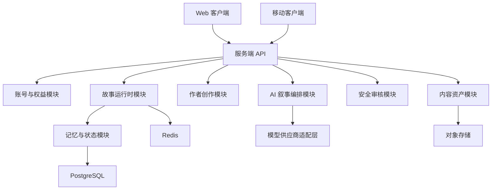

# InStory 开源项目架构规划

本文档定义 InStory 的初始工程架构。项目按“服务端 + 客户端”拆分，MVP 阶段优先实现纯文本互动叙事闭环，暂缓多人实时、完整知识图谱、图片/语音生成和复杂收益分成。

## 1. 架构目标

- 可开源协作：目录清晰、模块边界稳定、贡献者能独立认领任务。
- 可快速验证：先实现故事会话、回合生成、状态管理、回溯和基础作者配置。
- 可控 AI 输出：所有模型输出都必须经过结构化解析、状态校验、安全审核和持久化。
- 可渐进扩展：MVP 采用模块化单体，后续可按服务边界拆为独立服务。

## 2. 总体分层



MVP 建议从单仓库 monorepo 起步：

```text
InStory/
  apps/
    web/                 # Web 客户端
    mobile/              # 移动端，MVP 可暂缓
    server/              # 服务端应用入口
  packages/
    shared/              # 前后端共享类型、接口契约、常量
    story-engine/        # 叙事状态机、回合推进、回溯逻辑
    ai-orchestrator/     # Prompt 组装、模型调用、输出解析
    safety/              # 输入/输出审核与规则校验
  docs/
    ARCHITECTURE.md
  README.md
```

## 3. 服务端架构

### 3.1 技术选型建议

MVP 推荐：

- Runtime：Node.js / TypeScript
- API：REST + SSE
- 数据库：PostgreSQL
- 缓存：Redis
- ORM：Prisma 或 Drizzle
- 任务队列：BullMQ，后续可替换为 Kafka/RabbitMQ
- 模型接入：通过 `LLMProvider` 抽象兼容 OpenAI、兼容 OpenAI 协议的模型服务、本地模型网关

选择 TypeScript 的原因是前后端共享类型成本低，开源贡献门槛较低，也适合快速实现 Web MVP。

如果项目后续强调 JVM 生态或 Android 原生复用，可以将服务端迁移为 Kotlin + Spring Boot，但不建议在 MVP 阶段牺牲迭代速度。

### 3.2 服务端模块

#### API Gateway

职责：

- HTTP 路由
- 鉴权中间件
- 请求日志
- 限流
- 错误格式统一
- SSE 流式输出

MVP 不需要独立网关服务，直接作为 `apps/server` 的 API 层即可。

#### Auth & Entitlement

职责：

- 用户注册、登录、会话
- 匿名试玩用户
- 每日回合额度
- 会员/权益预留
- API Key 或 OAuth 预留

MVP 可先支持匿名用户和本地账号，支付系统只保留数据结构和额度扣减逻辑。

#### Story Runtime

职责：

- 创建读者会话
- 接收用户动作或对话
- 推进单个故事回合
- 保存回合输入、模型输出、状态快照
- 创建回溯节点
- 从历史节点恢复会话

这是 MVP 的核心模块。

关键对象：

```text
StorySession
SessionTurn
WorldState
StateSnapshot
TimelineNode
ReaderRole
```

#### Creator

职责：

- 管理作品
- 管理世界设定
- 管理角色档案
- 管理剧情锚点
- 管理角色约束
- 提供作者试玩入口

MVP 中作者工具应保持极简，优先支持 JSON/YAML 导入和基础表单编辑。

关键对象：

```text
Story
StoryVersion
World
Character
StoryAnchor
CharacterConstraint
```

#### AI Orchestrator

职责：

- 组装模型上下文
- 注入世界、角色、锚点、短期历史和摘要
- 调用模型
- 解析结构化 JSON
- 对失败输出进行重试或降级
- 返回叙事正文、选项、状态差异和记忆事件

建议定义统一接口：

```ts
export interface LLMProvider {
  generate(input: LLMGenerateInput): Promise<LLMGenerateResult>;
  stream?(input: LLMGenerateInput): AsyncIterable<LLMStreamChunk>;
}
```

AI 输出必须符合 JSON Schema。服务端不能直接信任模型文本，需要先解析、校验、修正或拒绝。

#### Memory & State

职责：

- 维护短期上下文
- 生成章节摘要
- 存储结构化事件
- 应用状态差异
- 校验世界一致性

MVP 不引入完整图数据库，先用 PostgreSQL JSONB 保存结构化状态，等叙事模型稳定后再拆出图数据库或向量检索。

#### Safety

职责：

- 用户输入审核
- 模型输出审核
- 世界规则校验
- 角色行为边界校验
- 高风险内容阻断或改写

MVP 可采用规则 + 模型审核双层策略：

- 规则层负责显式禁止项、额度绕过、越权操作。
- 模型审核负责语义风险和复杂内容分级。

#### Asset

职责：

- 封面
- 背景图
- 结局卡
- 音频资源
- CDN 地址

MVP 只保留封面和静态资源上传能力，多模态生成放到 Phase 2。

### 3.3 服务端目录建议

```text
apps/server/
  src/
    main.ts
    config/
    routes/
      auth.routes.ts
      story.routes.ts
      creator.routes.ts
    modules/
      auth/
      entitlement/
      story-runtime/
      creator/
      ai-orchestrator/
      memory/
      safety/
      asset/
    db/
      schema/
      migrations/
      client.ts
    jobs/
    observability/
    tests/
```

模块内部建议统一：

```text
module-name/
  module.ts          # 依赖装配
  controller.ts      # HTTP 层
  service.ts         # 业务逻辑
  repository.ts      # 数据访问
  types.ts           # 模块类型
  schemas.ts         # Zod/JSON Schema 校验
  tests/
```

## 4. 客户端架构

### 4.1 技术选型建议

MVP 推荐先做 Web：

- Framework：Next.js / React
- Language：TypeScript
- UI：Tailwind CSS 或轻量组件库
- State：Zustand 或 TanStack Query
- API：REST + SSE
- Editor：JSON/YAML 编辑器 + 表单逐步替换

移动端暂缓，待 Web 核心体验验证后再选择 React Native 或 Flutter。

### 4.2 Web 客户端模块

#### Story Plaza

故事广场：

- 作品列表
- 类型筛选
- 热度/完成率/AI 自由度展示
- 进入故事入口

MVP 可使用种子数据，不必先做复杂推荐。

#### Story Reader

互动阅读器：

- 剧情正文
- NPC 对话
- 智能选项
- 自由输入
- SSE 流式生成状态
- 回合历史
- 错误重试

这是客户端 MVP 的核心页面。

#### Character Panel

角色状态面板：

- 当前身份
- 情绪/体力/风险
- 关系值
- 线索
- 物品
- 阵营

状态来源必须以后端返回的 `state_snapshot` 或 `state_delta` 为准，客户端只做展示。

#### Timeline / Rewind

回溯与书签：

- 展示关键节点
- 展示章节摘要
- 从节点恢复会话
- 对比当前分支和原分支

MVP 可先支持手动回溯到自动生成的节点。

#### Creator Studio

作者工具：

- 创建作品
- 编辑世界设定
- 编辑角色档案
- 编辑剧情锚点
- 编辑约束
- 一键试玩

MVP 阶段不追求可视化工作流，先保证作者能稳定配置一部可试玩作品。

#### Account & Entitlement

账号与额度：

- 登录/退出
- 匿名试玩
- 每日剩余额度
- 回合消耗提示

支付和会员页可先占位。

### 4.3 Web 目录建议

```text
apps/web/
  src/
    app/
      plaza/
      story/[sessionId]/
      creator/
      account/
    components/
      reader/
      character-panel/
      timeline/
      creator/
      common/
    features/
      story-reader/
      creator-studio/
      entitlement/
    lib/
      api/
      sse/
      store/
      validators/
    styles/
    tests/
```

## 5. 前后端契约

共享契约放在 `packages/shared`，避免前后端各自猜字段。

```text
packages/shared/
  src/
    api/
      story.contract.ts
      creator.contract.ts
      auth.contract.ts
    domain/
      story.ts
      character.ts
      world.ts
      state.ts
      ai-output.ts
    schemas/
```

### 5.1 创建会话

```http
POST /api/stories/:storyId/sessions
```

请求：

```json
{
  "entryMode": "existing_character",
  "characterId": "lu_qinghe",
  "customRole": null
}
```

响应：

```json
{
  "sessionId": "sess_001",
  "openingTurn": {
    "narration": "你醒来时，窗外正落着细雨。",
    "choices": []
  },
  "stateSnapshot": {}
}
```

### 5.2 推进回合

```http
POST /api/sessions/:sessionId/turns
```

请求：

```json
{
  "inputType": "free_text",
  "content": "我压低声音问陆清河：外面是谁？",
  "choiceId": null
}
```

响应可分两种：

- 非流式：直接返回完整回合。
- 流式：SSE 返回 token、结构化结果和结束事件。

完整结果：

```json
{
  "turnId": "turn_002",
  "narration": "陆清河没有立刻回答。",
  "dialogues": [],
  "choices": [
    {"id": "c1", "text": "继续追问", "risk": "medium"}
  ],
  "stateDelta": {},
  "stateSnapshot": {},
  "timelineNode": null,
  "quota": {
    "remainingTurnsToday": 12
  }
}
```

### 5.3 回溯

```http
POST /api/sessions/:sessionId/rewind
```

请求：

```json
{
  "timelineNodeId": "node_003"
}
```

响应：

```json
{
  "sessionId": "sess_001_branch_002",
  "restoredStateSnapshot": {},
  "latestTurn": {}
}
```

## 6. 数据模型优先级

MVP 第一批表：

- `users`
- `stories`
- `story_versions`
- `worlds`
- `characters`
- `story_anchors`
- `character_constraints`
- `reader_sessions`
- `session_turns`
- `state_snapshots`
- `timeline_nodes`
- `memory_events`
- `entitlements`

Phase 2 再加入：

- `assets`
- `comments`
- `favorites`
- `shares`
- `endings`
- `achievements`
- `ugc_branches`
- `creator_revenue`
- `payments`

## 7. MVP 开发顺序

建议按以下顺序落地：

1. 搭建 monorepo、代码规范、CI、基础测试。
2. 定义 `packages/shared` 的领域类型和 API 契约。
3. 服务端实现故事、角色、锚点的种子数据读取。
4. 服务端实现 `Story Runtime` 状态机和回合持久化。
5. 实现 `AI Orchestrator` 的模型供应商抽象和 mock provider。
6. 接入真实模型，强制 JSON Schema 输出校验。
7. Web 实现互动阅读器、选项、自由输入和状态面板。
8. 实现短期上下文、章节摘要和回溯节点。
9. 实现极简作者工具。
10. 加入基础安全审核、额度限制和可观测日志。

## 8. 开源协作边界

适合新贡献者认领的任务：

- Web 阅读器 UI
- 状态面板组件
- 时间线组件
- 作者配置表单
- JSON Schema 定义
- Mock LLM provider
- 示例故事种子数据
- 单元测试和端到端测试
- 文档与示例部署

需要维护者把关的任务：

- AI Orchestrator 提示词结构
- 状态差异合并逻辑
- 安全审核策略
- 权益与计费模型
- 数据库 schema 破坏性变更

## 9. 暂不实现

MVP 明确不做：

- 多人实时房间
- 独立 NPC Agent 调度
- 完整图数据库
- 向量检索记忆
- 图片生成
- TTS
- 支付闭环
- 平行副本收益分成
- 复杂工作流式作者后台

这些能力应在纯文本叙事闭环验证后再进入 Phase 2/3。
