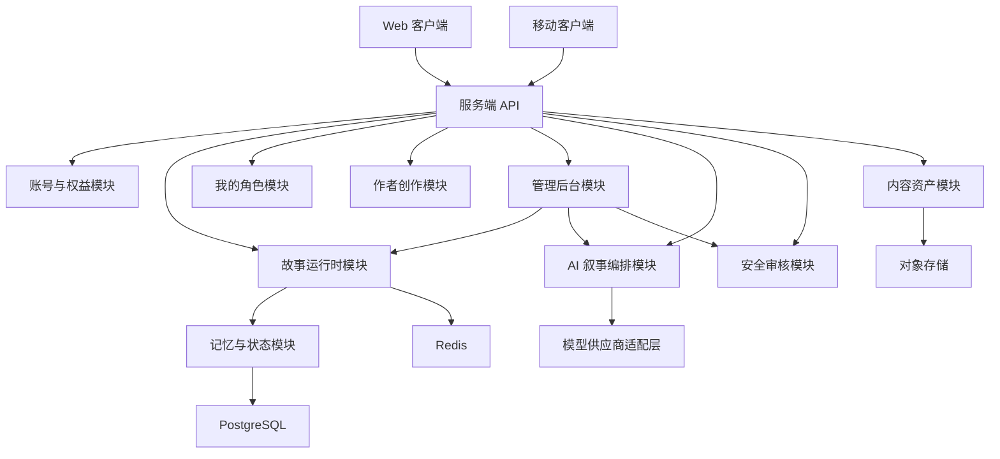

# InStory 开源项目架构规划

本文档定义 InStory 的初始工程架构。项目按“服务端 + 客户端”拆分，MVP 阶段优先实现“连续阅读 + 随时入戏”的纯文本叙事闭环，暂缓多人实时、完整知识图谱、图片/语音生成和复杂收益分成。

## 1. 架构目标

- 可开源协作：目录清晰、模块边界稳定、贡献者能独立认领任务。
- 可快速验证：先实现故事会话、段落式生成、随时入戏、状态管理、回溯和基础作者配置。
- 可控 AI 输出：所有模型输出都必须经过结构化解析、状态校验、安全审核和持久化。
- 可治理可观测：MVP 必须提供极简管理后台，用于模型配置查看、会话审计、审核占位和运行状态观察。
- 可渐进扩展：MVP 采用模块化单体，后续可按服务边界拆为独立服务。

## 2. 总体分层



MVP 建议从单仓库 monorepo 起步：

```text
InStory/
  apps/
    web/                 # Web 客户端
    mobile/              # 移动端，MVP 可暂缓
    server/              # 服务端应用入口
  packages/
    shared/              # 前后端共享类型、接口契约、常量
    story-engine/        # 叙事状态机、回合推进、回溯逻辑
    ai-orchestrator/     # Prompt 组装、模型调用、输出解析
    safety/              # 输入/输出审核与规则校验
  docs/
    ARCHITECTURE.md
  README.md
```

## 3. 服务端架构

### 3.1 技术选型建议

MVP 推荐：

- Runtime：Node.js / TypeScript
- API：REST + SSE
- 数据库：PostgreSQL
- 缓存：Redis
- ORM：Prisma 或 Drizzle
- 任务队列：BullMQ，后续可替换为 Kafka/RabbitMQ
- 模型接入：通过 `LLMProvider` 抽象兼容 OpenAI、兼容 OpenAI 协议的模型服务、本地模型网关

选择 TypeScript 的原因是前后端共享类型成本低，开源贡献门槛较低，也适合快速实现 Web MVP。

如果项目后续强调 JVM 生态或 Android 原生复用，可以将服务端迁移为 Kotlin + Spring Boot，但不建议在 MVP 阶段牺牲迭代速度。

### 3.2 服务端模块

#### API Gateway

职责：

- HTTP 路由
- 鉴权中间件
- 请求日志
- 限流
- 错误格式统一
- SSE 流式输出

MVP 不需要独立网关服务，直接作为 `apps/server` 的 API 层即可。

#### Auth & Entitlement

职责：

- 用户注册、登录、会话
- 匿名试玩用户
- 每日免费额度
- 会员/权益预留
- API Key 或 OAuth 预留

MVP 可先支持匿名用户和本地账号。积分、支付、提现和复杂分账不进入 MVP，只作为商业化阶段的后续模块。

#### Story Runtime

职责：

- 创建读者会话
- 生成连续阅读段落
- 识别或生成关键介入节点
- 接收用户入戏动作或对话
- 将用户介入结果写回故事正文
- 保存回合输入、模型输出、状态快照
- 创建回溯节点
- 从历史节点恢复会话

这是 MVP 的核心模块。

关键对象：

```text
StorySession
SessionTurn
WorldState
StateSnapshot
TimelineNode
ReaderRole
InterventionNode
```

Story Runtime 不应把用户每次翻页都建模为强制选择。MVP 推荐将叙事推进拆成两类：

- `read_segment`：阅读模式下生成连续正文、小节摘要和可选介入点。
- `intervention_turn`：用户点击“入戏”或响应关键节点后提交动作，AI 生成影响结果并更新状态。

作品需要声明 `experienceMode`，用于控制作者预设和 AI 临场生成的权重：

```ts
type ExperienceMode = "scripted" | "coauthored" | "improvised";

type ExperienceModeConfig = {
  mode: ExperienceMode;
  authoredWeight: number;
  aiRewriteWeight: number;
  improvisationWeight: number;
  branchStrictness: "strict" | "guided" | "loose";
};
```

建议映射：

| mode | 产品名称 | authoredWeight | aiRewriteWeight | improvisationWeight | branchStrictness |
| --- | --- | ---: | ---: | ---: | --- |
| `scripted` | 剧本入戏 | 0.8 | 0.15 | 0.05 | `strict` |
| `coauthored` | 共演入戏 | 0.5 | 0.35 | 0.15 | `guided` |
| `improvised` | 即兴入戏 | 0.25 | 0.45 | 0.3 | `loose` |

`experienceMode` 是产品层的体验承诺，不是直接把权重暴露给读者。服务端使用它决定查找作者预设的优先级、提示词中对剧情锚点的约束强度、是否允许 AI 生成偏离主线的临场结果，以及是否需要更严格的状态校验。

MVP 实现边界：

- `coauthored` / `共演入戏` 是唯一需要完整验证的主路径。
- `scripted` / `剧本入戏` 和 `improvised` / `即兴入戏` 先作为作品字段和策略参数保留，运行时可先复用 `coauthored` 流程，只调整提示词约束和作者预设优先级。
- 不为三种模式分别实现三套运行时，避免 MVP 过早复杂化。

`read_segment` 不应总是实时调用模型。推荐按以下优先级生成阅读内容：

1. 命中作者预设小节或选择后的预设后续，直接读取预设正文。
2. 命中当前用户会话中已经生成过的 segment，直接读取持久化结果。
3. 需要用户角色个性化、自由行动回写或预设分支缺失时，再调用 AI 生成。

不同体验模式下，上述优先级的执行方式不同：

- `scripted`：必须优先命中作者预设。缺失预设时，AI 只能根据最近锚点补桥段，不应创造重大新事件。
- `coauthored`：优先使用作者锚点和分支方向，允许 AI 扩写过场、心理、环境和局部冲突。
- `improvised`：作者规则和安全边界优先，AI 可在边界内生成更多临场事件，但必须写回状态和记忆，便于后续收束。

每个生成结果必须绑定 `sessionId`、`userId` 或匿名本地用户标识、`storyId`、`storyVersionId`、`segmentId` 和输入快照。接入用户系统后，不同用户的生成结果互不覆盖；同一用户回到历史节点时读取自己的会话分支。

作者工具应支持 `defaultSegmentLength` 或类似配置，例如 `short`、`standard`、`long`，由 Story Runtime 转换为目标字数、段落数和最大 token。这样阅读模式能生成一个完整小节，而不是每次只追加一句话。

#### Reader Profile

职责：

- 管理用户自己的入戏角色。
- 在进入故事前提供角色选择。
- 将角色设定注入 AI 上下文。
- 在阅读器展示当前身份。

MVP 可先使用匿名或本地用户，后续接入账号体系。

关键对象：

```text
ReaderProfile
ReaderRole
ProfileAvatar
```

`ReaderProfile` 是用户资产，和作者创建的 `Character` 不同：

- `Character`：故事世界内的原生角色，由作者配置。
- `ReaderProfile`：用户自己的分身，可跨故事复用。
- `ReaderRole`：某次会话中实际使用的身份快照，来源可以是 `Character`、`ReaderProfile` 或一次性自定义角色。

MVP 允许创作故事时从 `ReaderProfile` 选择故事演员。服务端创建故事时会复制一份 `Character` 快照，避免用户后续修改自己的入戏角色后影响已有故事设定。

选择故事演员时必须按 `ownerId` 过滤，只允许使用当前用户自己的 `ReaderProfile`。管理员后台不参与普通用户的角色选择与故事创建流程。

#### Creator

职责：

- 创建作品草稿
- 管理作品基础信息
- 管理世界设定
- 管理角色档案
- 管理剧情锚点
- 管理角色约束
- 提供作者试玩入口

MVP 中作者工具应保持极简，入口在客户端 `创作` 导航中，优先支持基础表单编辑。普通用户必须能创建故事，配置足以让 AI 生成第一轮体验的核心字段；复杂分支图、可视化编排、审核发布和创作者收益看板放到后续阶段。

关键对象：

```text
Story
StoryVersion
World
Character
StoryAnchor
StorySegment
StoryBranch
SegmentLengthPreset
ExperienceModeConfig
CharacterConstraint
StoryPublishStatus
```

`Story` MVP 字段：

```ts
type Story = {
  id: string;
  ownerId: string | null;
  visibility: "private" | "public";
  title: string;
  tagline: string;
  genre: string;
  coverUrl: string | null;
  aiFreedom: "low" | "medium" | "high";
  experienceMode: ExperienceMode;
  defaultSegmentLength: "short" | "standard" | "long";
};
```

`ownerId` 表示故事归属。种子故事和平台示例故事可以为 `null`，普通用户在客户端创作入口创建的故事必须由服务端写入当前用户标识。客户端不能提交或覆盖 `ownerId`。`visibility` 控制是否进入公共故事探索，新建用户故事默认 `private`，平台示例故事默认 `public`。

`World` MVP 字段：

```ts
type World = {
  storyId: string;
  premise: string;
  rules: string[];
  locations: Array<{
    id: string;
    name: string;
    description: string;
  }>;
};
```

`StoryVersion` 至少应包含：

```ts
type StoryVersion = {
  id: string;
  storyId: string;
  experienceMode: ExperienceMode;
  defaultSegmentLength: "short" | "standard" | "long";
};
```

MVP 当前工程仍以 SQLite JSON payload 保存故事配置。实现时可以先把 `experienceMode` 与 `defaultSegmentLength` 写入 `StorySummary` payload；等 `StoryVersion` 表落地后再迁移到版本表。

故事演员创建策略：

```text
ReaderProfile -> Character snapshot
```

复制字段包括名称、身份背景、性格、头像引用和约束摘要。运行时读者输入动作或对话后，AI Orchestrator 根据当前读者身份、故事演员设定、世界规则和上下文生成演员回应。

商业化阶段再加入积分经济相关对象：

```text
CreditAccount
CreditLedgerEntry
GenerationUsage
CreatorReward
```

`CreditLedgerEntry` 记录读者消耗或创作者获得积分，必须包含 `userId`、`storyId`、`sessionId`、`amount`、`reason`、`createdAt`。`GenerationUsage` 记录每次 AI 调用的模型、token、延迟和估算成本。MVP 不实现这些对象。

#### AI Orchestrator

职责：

- 组装模型上下文
- 注入世界、作者角色、用户角色、锚点、短期历史和摘要
- 注入作品的 `experienceMode`，决定锚点约束强度、临场生成空间和输出校验策略
- 调用模型
- 解析结构化 JSON
- 对失败输出进行重试或降级
- 返回阅读正文、介入节点、选项、状态差异和记忆事件

建议定义统一接口：

```ts
export interface LLMProvider {
  generate(input: LLMGenerateInput): Promise<LLMGenerateResult>;
  stream?(input: LLMGenerateInput): AsyncIterable<LLMStreamChunk>;
}
```

AI 输出必须符合 JSON Schema。服务端不能直接信任模型文本，需要先解析、校验、修正或拒绝。

#### Memory & State

职责：

- 维护短期上下文
- 生成章节摘要
- 存储结构化事件
- 应用状态差异
- 校验世界一致性

MVP 不引入完整图数据库，先用 PostgreSQL JSONB 保存结构化状态，等叙事模型稳定后再拆出图数据库或向量检索。

#### Safety

职责：

- 用户输入审核
- 模型输出审核
- 世界规则校验
- 角色行为边界校验
- 高风险内容阻断或改写

MVP 可采用规则 + 模型审核双层策略：

- 规则层负责显式禁止项、额度绕过、越权操作。
- 模型审核负责语义风险和复杂内容分级。

#### Asset

职责：

- 封面
- 背景图
- 结局卡
- 音频资源
- CDN 地址

MVP 只保留封面和静态资源上传能力，多模态生成放到 Phase 2。

#### Admin Console

管理后台在 MVP 中定位为“AI 叙事系统控制台”，服务开发、调试、审核和模型治理，不做完整运营后台。

MVP 职责：

- 查看运行状态：服务健康、存储类型、SQLite 路径、故事数、会话数。
- 查看模型配置：Provider、Base URL、Model、是否使用真实模型。API Key 不返回明文。
- 查看故事配置：stories、worlds、characters、anchors。
- 查看会话审计：最近会话、回合输入、AI 输出、状态快照、时间线。
- 审核占位：返回输入/输出审核事件列表，MVP 可为空数组。

MVP 不做：

- 完整 RBAC。
- 多租户后台。
- 复杂人工审核工作流。
- 支付/财务后台。
- 可视化 Prompt 编排器。
- 多模型 AB 实验平台。

管理后台 API 初期使用 `ADMIN_TOKEN` 保护：

```http
Authorization: Bearer dev-admin-token
```

本地开发未设置 `ADMIN_TOKEN` 时，默认允许访问 Admin API；部署环境必须设置。

### 3.3 服务端目录建议

```text
apps/server/
  src/
    main.ts
    config/
    routes/
      auth.routes.ts
      story.routes.ts
      creator.routes.ts
      admin.routes.ts
    modules/
      auth/
      entitlement/
      story-runtime/
      creator/
      admin/
      ai-orchestrator/
      memory/
      safety/
      asset/
    db/
      schema/
      migrations/
      client.ts
    jobs/
    observability/
    tests/
```

模块内部建议统一：

```text
module-name/
  module.ts          # 依赖装配
  controller.ts      # HTTP 层
  service.ts         # 业务逻辑
  repository.ts      # 数据访问
  types.ts           # 模块类型
  schemas.ts         # Zod/JSON Schema 校验
  tests/
```

## 4. 客户端架构

### 4.1 技术选型建议

MVP 推荐先做 Web：

- Framework：Next.js / React
- Language：TypeScript
- UI：Tailwind CSS 或轻量组件库
- State：Zustand 或 TanStack Query
- API：REST + SSE
- Editor：JSON/YAML 编辑器 + 表单逐步替换

移动端暂缓，待 Web 核心体验验证后再选择 React Native 或 Flutter。

### 4.2 Web 客户端模块

#### Story Plaza

故事广场：

- 作品列表
- 类型筛选
- 热度/完成率/AI 自由度展示
- 进入故事入口

MVP 可使用种子数据，不必先做复杂推荐。

#### Story Reader

阅读器：

- 连续剧情正文
- NPC 对话
- 常驻“入戏”按钮
- 关键节点提示
- 入戏面板：自由输入、行动建议、当前角色
- 智能选项，仅在关键节点或入戏模式出现
- SSE 流式生成状态
- 回合历史
- 错误重试

这是客户端 MVP 的核心页面。

阅读器应包含两种状态：

```text
ReadingMode
InterventionMode
```

`ReadingMode` 以顺滑翻阅为主，不强制用户每一步选择。`InterventionMode` 由用户点击“入戏”或关键介入节点触发，用户可输入一句话、一个动作或选择建议行动。入戏完成后，AI 将结果写回正文，页面回到阅读模式。

#### My Characters

我的角色：

- 角色列表
- 创建角色
- 编辑名称、性别、性格、头像或形象 URL、身份背景、AI 互动描述
- 进入故事前选择角色
- 阅读器展示当前身份

MVP 中头像可先使用 URL 或默认占位图。AI 生成图片或视频形象属于 Phase 2。

#### Character Panel

角色状态面板：

- 当前身份
- 情绪/体力/风险
- 关系值
- 线索
- 物品
- 阵营

状态来源必须以后端返回的 `state_snapshot` 或 `state_delta` 为准，客户端只做展示。

#### Timeline / Rewind

回溯与书签：

- 展示关键节点
- 展示章节摘要
- 从节点恢复会话
- 对比当前分支和原分支

MVP 可先支持手动回溯到自动生成的节点。

#### Creator Studio

作者工具：

- 创建作品
- 编辑世界设定
- 编辑角色档案
- 编辑剧情锚点
- 编辑约束
- 一键试玩

MVP 阶段不追求可视化工作流，先保证作者能在客户端创作入口稳定创建并配置一部可试玩作品。第一版创建表单包含故事 ID、标题、标语、类型、封面图、世界前提、起点地点、起点场景、世界规则、入戏体验模式、默认生成长度和 AI 自由度。作者工具和“我的角色”要保持边界清晰：作者创建故事世界和世界内角色，读者创建自己的入戏身份。

#### Account & Entitlement

账号与额度：

- 登录/退出
- 匿名试玩
- 每日免费额度

支付和会员页可先占位。

#### Admin Console

管理后台：

- `/admin`：状态总览，展示服务健康、模型配置、存储配置、统计数字。
- `/admin/models`：模型配置查看与测试台。
- `/admin/stories`：故事配置查看和基础信息调试编辑。
- `/admin/sessions`：最近会话与回合审计。
- `/admin/moderation`：审核事件占位。

MVP 管理后台以开发调试、模型配置、Provider 验证和运行观察为主，不作为普通用户创作入口。用户创建故事必须进入客户端 `创作` 模块。

### 4.3 Web 目录建议

```text
apps/web/
  src/
    app/
      plaza/
      profiles/
      story/[sessionId]/
      creator/
      account/
      admin/
    components/
      reader/
      profile-selector/
      character-panel/
      timeline/
      creator/
      common/
    features/
      story-reader/
      reader-profiles/
      creator-studio/
      entitlement/
    lib/
      api/
      sse/
      store/
      validators/
    styles/
    tests/
```

## 5. 前后端契约

共享契约放在 `packages/shared`，避免前后端各自猜字段。

```text
packages/shared/
  src/
    api/
      story.contract.ts
      creator.contract.ts
      auth.contract.ts
    domain/
      story.ts
      character.ts
      world.ts
      state.ts
      ai-output.ts
    schemas/
```

### 5.1 创建会话

```http
POST /api/stories/:storyId/sessions
```

请求：

```json
{
  "entryMode": "custom_role",
  "characterId": "lu_qinghe",
  "readerProfileId": "profile_001",
  "customRole": null
}
```

响应：

```json
{
  "sessionId": "sess_001",
  "openingTurn": {
    "narration": "你醒来时，窗外正落着细雨。",
    "choices": []
  },
  "stateSnapshot": {}
}
```

如果用户选择自己的角色进入故事，`readerProfileId` 优先于一次性 `customRole`。服务端应把用户角色保存为本次会话的 `ReaderRole` 快照，避免后续用户修改角色档案影响历史会话。

### 5.2 我的角色 API

```http
GET /api/reader/profiles
POST /api/reader/profiles
PUT /api/reader/profiles/:profileId
DELETE /api/reader/profiles/:profileId
```

创建请求：

```json
{
  "name": "林向晚",
  "gender": "女",
  "personality": "冷静、敏感、习惯先观察再行动。",
  "avatarUrl": "https://example.com/avatar.png",
  "description": "现代法医，被卷入雨夜旧宅谜案。"
}
```

响应：

```json
{
  "profile": {
    "id": "profile_001",
    "ownerId": "user_001",
    "name": "林向晚",
    "gender": "女",
    "personality": "冷静、敏感、习惯先观察再行动。",
    "avatarUrl": "https://example.com/avatar.png",
    "description": "现代法医，被卷入雨夜旧宅谜案。"
  }
}
```

### 5.3 我的故事与创作 API

```http
GET /api/me/stories
POST /api/stories
PUT /api/me/stories/:storyId
DELETE /api/me/stories/:storyId
```

`GET /api/me/stories` 只返回当前用户创建的故事，用于客户端 `创作 -> 我的故事`。`GET /api/stories` 是探索入口，只返回平台示例故事或 `visibility = "public"` 的用户故事。

创建故事请求不包含 `ownerId`，由服务端按当前用户写入：

```json
{
  "id": "moon-market",
  "title": "月下市集",
  "tagline": "你在午夜市集里寻找被偷走的名字。",
  "genre": "奇幻悬疑",
  "coverUrl": null,
  "visibility": "private",
  "premise": "午夜市集只接待遗失重要之物的人。",
  "openingLocationName": "市集入口",
  "openingLocationDescription": "纸灯笼在雾里摇晃。",
  "worldRules": ["不能直接说出真名"],
  "castProfileIds": ["profile_001"],
  "experienceMode": "coauthored",
  "defaultSegmentLength": "standard",
  "aiFreedom": "medium"
}
```

`castProfileIds` 只能引用当前用户自己的角色。服务端会复制这些 `ReaderProfile` 为故事内 `Character` 快照，供 AI 在读者互动时模拟回应。

用户侧故事管理只允许操作 `ownerId` 等于当前用户的故事。平台示例故事、种子故事和其他用户作品不能通过 `/api/me/stories/:storyId` 修改或删除。

### 5.4 阅读推进与入戏

```http
POST /api/sessions/:sessionId/read
POST /api/sessions/:sessionId/interventions
```

阅读推进请求：

```json
{
  "mode": "continue",
  "afterSegmentId": "segment_003"
}
```

阅读推进响应：

```json
{
  "segment": {
    "id": "segment_004",
    "narration": "雨声沿着屋檐连成细线，陆清河忽然停下脚步。",
    "dialogues": [],
    "interventionNode": {
      "id": "node_intervene_004",
      "reason": "npc_question",
      "prompt": "陆清河回头看你，问你是否相信他。"
    }
  },
  "stateSnapshot": {}
}
```

入戏请求：

```json
{
  "interventionNodeId": "node_intervene_004",
  "inputType": "free_text",
  "content": "我压低声音问陆清河：外面是谁？",
  "choiceId": null
}
```

响应可分两种：

- 非流式：直接返回完整回合。
- 流式：SSE 返回 token、结构化结果和结束事件。

完整结果：

```json
{
  "turnId": "turn_002",
  "mode": "intervention",
  "narration": "陆清河没有立刻回答。",
  "dialogues": [],
  "choices": [
    {"id": "c1", "text": "继续追问", "risk": "medium"}
  ],
  "stateDelta": {},
  "stateSnapshot": {},
  "timelineNode": null,
  "quota": {
    "remainingTurnsToday": 12
  }
}
```

兼容性说明：MVP 早期可以继续使用 `POST /api/sessions/:sessionId/turns` 承载入戏回合；当阅读模式成熟后，再拆分 `read` 与 `interventions`。

### 5.5 回溯

```http
POST /api/sessions/:sessionId/rewind
```

请求：

```json
{
  "timelineNodeId": "node_003"
}
```

### 5.6 Admin API

Admin API 初期只读，使用 `Authorization: Bearer <ADMIN_TOKEN>` 保护。

```http
GET /api/admin/status
GET /api/admin/models
GET /api/admin/stories
GET /api/admin/sessions
GET /api/admin/sessions/:sessionId
GET /api/admin/moderation/events
```

`GET /api/admin/status` 响应示例：

```json
{
  "service": "instory-server",
  "storage": {
    "type": "sqlite",
    "databasePath": "data/instory.sqlite"
  },
  "counts": {
    "stories": 1,
    "sessions": 3
  }
}
```

`GET /api/admin/models` 响应示例：

```json
{
  "provider": "mock",
  "baseUrl": null,
  "model": null,
  "apiKeyConfigured": false
}
```

响应：

```json
{
  "sessionId": "sess_001_branch_002",
  "restoredStateSnapshot": {},
  "latestTurn": {}
}
```

## 6. 数据模型优先级

MVP 第一批表：

- `users`
- `stories`
- `story_versions`
- `worlds`
- `characters`
- `reader_profiles`
- `story_anchors`
- `character_constraints`
- `reader_sessions`
- `session_turns`
- `state_snapshots`
- `timeline_nodes`
- `memory_events`
- `entitlements`

Phase 2 再加入：

- `assets`
- `comments`
- `favorites`
- `shares`
- `endings`
- `achievements`
- `ugc_branches`
- `creator_revenue`
- `payments`

积分经济表放到商业化阶段：

- `credit_accounts`
- `credit_ledger_entries`
- `generation_usage`
- `creator_rewards`
- `creator_payouts`
- `anti_fraud_events`

## 7. MVP 开发顺序

建议按以下顺序落地：

1. 搭建 monorepo、代码规范、CI、基础测试。
2. 定义 `packages/shared` 的领域类型和 API 契约。
3. 服务端实现故事、角色、锚点的种子数据读取。
4. 服务端实现 `Story Runtime` 状态机和回合持久化。
5. 实现 `AI Orchestrator` 的模型供应商抽象和 mock provider。
6. 接入真实模型，强制 JSON Schema 输出校验。
7. Web 实现阅读模式、入戏按钮、关键节点提示和状态面板。
8. 实现我的角色：创建、选择、进入故事时注入 AI 上下文。
9. 实现客户端创作入口和 `POST /api/stories`，支持最小故事创建。
10. 实现短期上下文、章节摘要和回溯节点。
11. 实现极简管理后台：状态、模型配置、故事配置、会话审计、审核占位。
12. 实现极简作者工具。
13. 加入基础安全治理占位和可观测日志。

## 8. 开源协作边界

适合新贡献者认领的任务：

- Web 阅读器 UI
- 我的角色表单和选择器
- 状态面板组件
- 时间线组件
- 作者配置表单
- JSON Schema 定义
- Mock LLM provider
- 示例故事种子数据
- 管理后台只读页面
- Admin API 测试
- 单元测试和端到端测试
- 文档与示例部署

需要维护者把关的任务：

- AI Orchestrator 提示词结构
- 状态差异合并逻辑
- 安全审核策略
- 权益与计费模型
- 数据库 schema 破坏性变更

## 9. 暂不实现

MVP 明确不做：

- 多人实时房间
- 独立 NPC Agent 调度
- 完整图数据库
- 向量检索记忆
- 图片生成
- TTS
- 支付闭环
- 平行副本收益分成
- 复杂工作流式作者后台
- 完整运营管理后台

这些能力应在纯文本叙事闭环验证后再进入 Phase 2/3。
